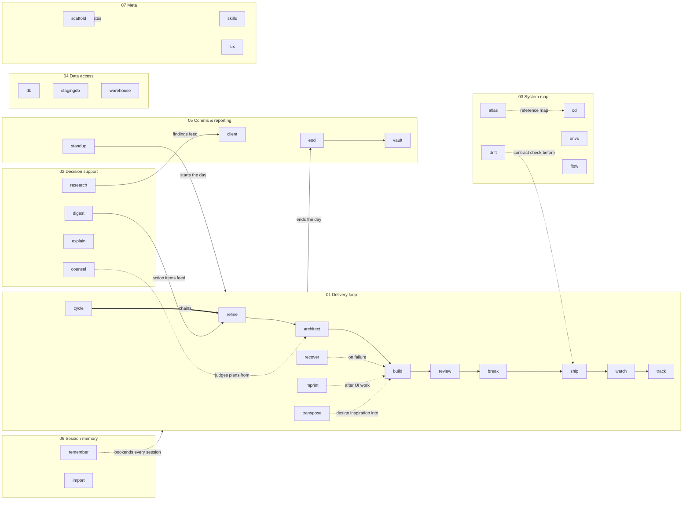

# Claude Workflow

Personal Claude Code skills for one machine, grouped into collections by how they relate to each
other. The live copies at `~/.claude/skills/` are the source of truth; this repo is the versioned
backup and the map of how they fit together.

Everything here is stored with real hosts, roles, database names and organisation names replaced by
placeholders, so the repo is safe to hold the skills without holding the infrastructure they touch.
Restoring puts the real values back.

## Restore onto a machine

```bash
# 1. fill in the real values
cp values.example.env values.local.env && $EDITOR values.local.env

# 2. restore, substituting placeholders as it copies
./hydrate.sh ~/.claude/skills
```

Look before you leap:

```bash
./hydrate.sh /tmp/preview --dry-run
```

`hydrate.sh` never modifies this repo — placeholders stay placeholders here. Any key left blank in
`values.local.env` keeps its placeholder in the output and is listed at the end, so an unfilled
value fails loudly instead of quietly producing a broken command.

If you only want the structure and none of the real values, `cp -R collections/*/* ~/.claude/skills/`
still works — you just get placeholders.

## Collections

### 01 — Delivery loop
The core build-and-ship pipeline. `/cycle` chains them end to end.

| Skill | Role in the loop |
|---|---|
| refine | Rough ask → clear brief |
| architect | Brief → confirmed plan |
| build | Plan → code |
| review | Code vs. plan (static) |
| break | Adversarial stress-testing (dynamic) |
| ship | Commit + push to main (GitLab) |
| watch | Pipeline to completion + log triage |
| track | Update the progress tracker |
| recover | Diagnose a failed build before reacting |
| imprint | Capture UI patterns after building a component |
| transpose | Adapt a reference design philosophy through the project's own tokens/registry |
| cycle | Chains refine → … → track as one command |

### 02 — Decision support
Thinking tools: judge, research, explain, extract.

| Skill | What it judges/produces |
|---|---|
| counsel | Panel of blind agents deliberates a decision |
| research | Sourced, verified web research → doc in ~/Desktop/research |
| explain | Plain-English walkthrough of a feature |
| digest | Pasted conversation → owned action items |

### 03 — System map
Cross-repo awareness for the five {{PRODUCT}} repos.

| Skill | Scope |
|---|---|
| atlas | Load all five repos' context (reference) |
| cd | Focus the session into one repo (counterpart to atlas) |
| drift | Contract diff: web/admin calls vs. service openapi.yaml |
| envs | staging environment URLs |
| flow | {{PRODUCT}} n8n workflows on {{COMPANY}}'s instance |

### 04 — Data access
Read paths into {{COMPANY}}'s databases. Hosts, roles, database names and passwords are all placeholders
here — see [Tokenized values](#tokenized-values).

| Skill | Target |
|---|---|
| db | Production Postgres (postgres-prod MCP) |
| stagingdb | staging Postgres cluster (~150 platform DBs) |
| warehouse | {{WAREHOUSE_PRODUCT}} warehouse (read-only analytics) |

### 05 — Comms & reporting
Turning work into words for other people.

| Skill | Audience |
|---|---|
| standup | Me, start of day |
| eod | Me/team, end of day |
| client | Stakeholders, plain English |
| vault | Obsidian vault notes + CTO-grade system docs (ADRs, tech debt register, roadmap, runbooks with the handover test; tokenized portfolio export on request) |

### 06 — Session memory
Continuity between sessions and repos.

| Skill | What it carries |
|---|---|
| remember | Save/restore session state via memory.md |
| import | Bring the personal context-template dir into a new repo |

### 07 — Meta
Skills about skills.

| Skill | What it does |
|---|---|
| scaffold | Create and register a new skill |
| skills | List all installed skills, live from disk |
| six | Reference card for the workflow-multiplier skills |

## How they relate



## Tokenized values

Nothing in `collections/` names a real host, address, database, or organisation. Every one of them
is a brace token — hostnames and internal IPs, database roles, database and schema names, the
warehouse product and its CLI, the GitLab group, repo names, company and product names, and all
passwords. [`values.example.env`](values.example.env) lists every one with a note on what it wants.

The real values live in `values.local.env`, which is gitignored and never leaves the machine.

**Braces, not angle brackets.** `<COMPANY>` is parsed as an unknown HTML tag and rendered as
nothing, so a placeholder written that way silently vanishes from this page. The one exception is
[`context-template/`](context-template/), which keeps its own `<ANGLE_BRACKETS>` convention across
169 hand-filled slots — it is a template you complete by hand, not a hydration target.

**One thing is genericised rather than tokenized:** the pre-production environment is called
**staging** throughout. That is a permanent rename, not a placeholder — it does not hydrate back to
anything. Its host, role and database name are separate keys that do.

## Context template

[`context-template/`](context-template/) is the reusable `context/` directory the skills read
from — project overview, architecture, code standards, build plan, library docs, progress
tracker, and the three UI files. Unlike the collections above it is **generic boilerplate**, not a
personal backup: structure and stack-neutral rules are filled in, everything project-specific is a
placeholder. Anyone can drop it into a repo.

```bash
cp -R context-template ./context && echo "context/" >> .gitignore
```

Then run `/import` to ground it in that codebase. See its
[README](context-template/README.md).

## Licence

[MIT](LICENSE).
